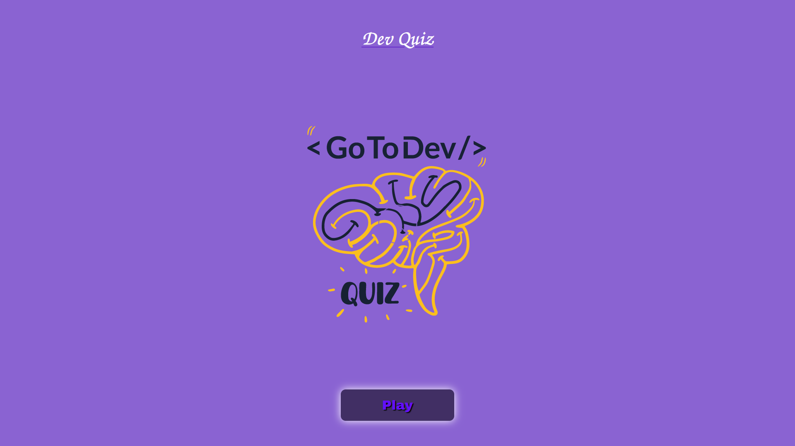
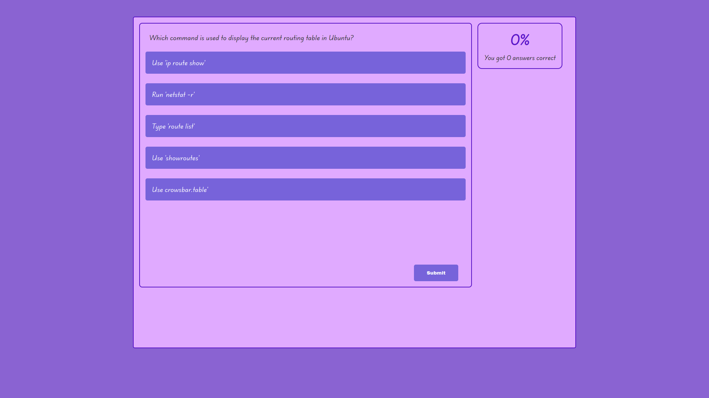
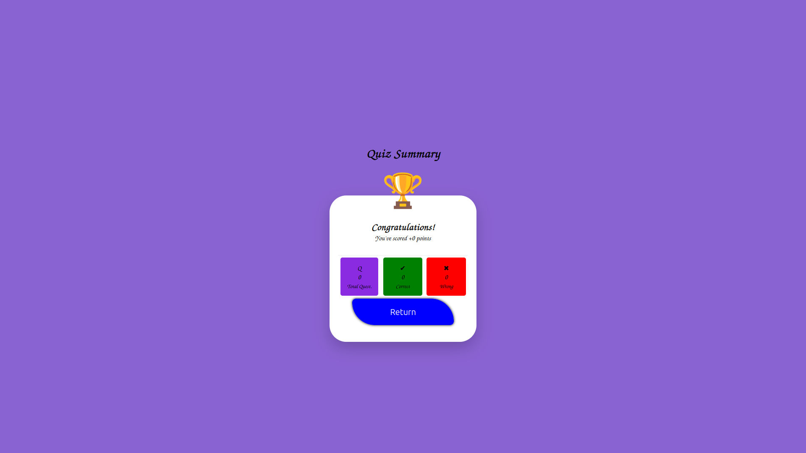

# Quiz-Dev

<h1 align="center">
  <br>
  🚀 DevQuiz: O Desafio de Lógica
  <br>
</h1>

<h4 align="center">Um Quiz interativo de Lógica de Programação e Tecnologia.</h4>

<p align="center">
  
  
  
</p>

<p align="center">
  <a href="#-sobre">Sobre</a> •
  <a href="#-funcionalidades">Funcionalidades</a> •
  <a href="#-tecnologias">Tecnologias</a> •
  <a href="#-layout">Layout</a> •
  <a href="#-time">O Time</a> •
  <a href="#-como-rodar-o-projeto">Como Rodar</a>
</p>

---

## 💻 Sobre

O **DevQuiz** é uma aplicação web desenvolvida para testar conhecimentos em desenvolvimento de software, infraestrutura e lógica de programação. O projeto consome dados reais via API, trazendo desafios atualizados sobre Linux, Docker, JavaScript e DevOps.

Este projeto foi desenvolvido em **9 dias** com foco na construção de um MVP (Produto Mínimo Viável) sólido, utilizando metodologias ágeis (Kanban) para organização das tarefas e arquitetura modular no Front-end.

---

## ⚙️ Funcionalidades

- [x] **Consumo de API:** Integração direta com a [QuizAPI.io](https://quizapi.io/).
- [x] **Fallback e Cache (Mock):** Sistema inteligente de fallback local para contornar limites de requisição da API, garantindo que o jogo funcione offline ou quando a cota diária for excedida.
- [x] **Feedback Visual e Sonoro:** Indicação imediata de acerto (Verde) ou erro (Vermelho), com efeitos de áudio integrados.
- [x] **Sistema de Pontuação:** Score dinâmico baseado no desempenho do usuário com multiplicador de XP.
- [x] **Design Responsivo:** Layout adaptável e fluido para Desktop e Mobile.

---

## 🎨 Layout

> **Nota:** O layout foi pensado para ser limpo ("Clean Code"), imersivo e blindado contra seleções acidentais, simulando a experiência de um aplicativo nativo.

| Tela Inicial | Quiz (Gameplay) | Resultado Final |
|:---:|:---:|:---:|
|  |  |  |

---

## 🛠 Tecnologias

As seguintes ferramentas foram usadas na construção do projeto:

*  **HTML5**: Estrutura semântica.
*  **CSS3**: Estilização, variáveis globais e Flexbox/Grid.
*  **JavaScript (ES6+)**: Lógica orientada a módulos, manipulação de DOM, LocalStorage e Fetch API.
*  **GitHub Projects**: Gestão de Sprints e Issues.

---

## 👥 O Time

Projeto desenvolvido pela equipe de Engenharia de Software:

| Avatar | Colaborador | Função no Projeto | GitHub |
|:---:|:---:|:---|:---:|
|  | **Carlos Henrique** | *Tech Lead, Scrum Master, QA, Front-end(CSS & Style) & Back-end Logic* | [@MadureiraHenrique](https://github.com/MadureiraHenrique) |
|  | **Ygor Morais** | *Back-end Logic & Front-end (CSS & Style)* | [@basalt1337](https://github.com/basalt1337) |
|  | **Pedro Luis** | *Sound Engineer* | [@Sentaquelavem](https://github.com/Sentaquelavem) |
|  | **Alessandra Souza** | *Structure HTML & Responsivity* | [@alezoka](https://github.com/alezoka) |

---

## 📂 Organização do Projeto (Sprints)

Utilizamos o GitHub Projects para organizar o desenvolvimento em 3 Sprints curtas:

1.  **Sprint 1:** Estrutura HTML, conexão com API e CSS Base.
2.  **Sprint 2:** Lógica de pontuação, validação de respostas, módulos JS e troca de telas.
3.  **Sprint 3:** Polimento visual, implementação de áudio, responsividade e correção de bugs.

---

## 🗺️ Próximas Atualizações (Roadmap)

- [ ] Implementação de um Cronômetro por questão para aumentar a dificuldade.
- [ ] Ranking local de melhores pontuações (Leaderboard).
- [ ] Expansão de categorias e níveis de dificuldade na tela inicial.

---

## 🚀 Como rodar o projeto

1. Clone o repositório:
   ```bash
   git clone [https://github.com/MadureiraHenrique/Quiz-Dev.git](https://github.com/MadureiraHenrique/Quiz-Dev.git)
